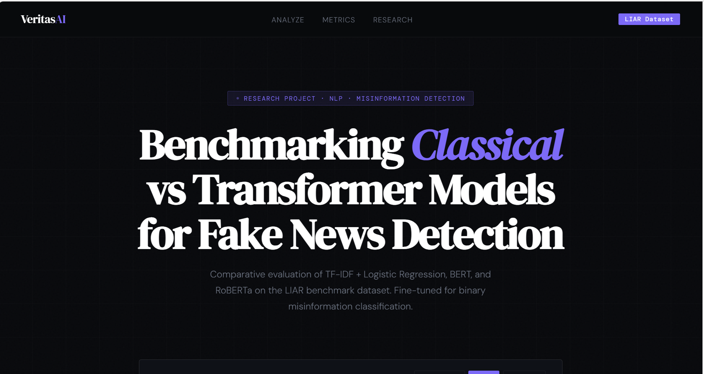
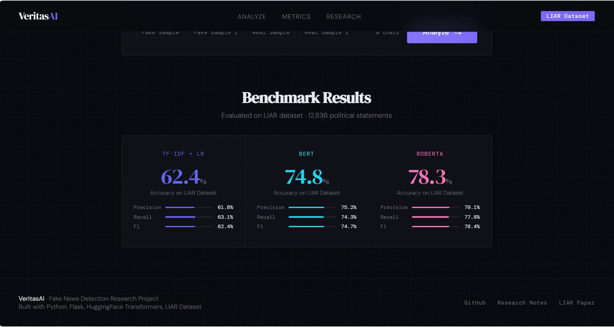
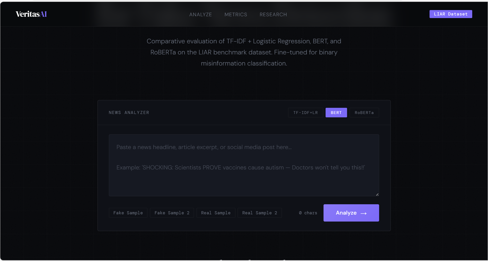

# VeritasAI — Fake News Detection

> Benchmarking Classical vs Transformer-based Models for Misinformation Detection


---

## 📌 Overview

Comparative evaluation of TF-IDF + Logistic Regression, BERT, and RoBERTa for binary fake news classification on the LIAR benchmark dataset (12,836 political statements).

| Model | Accuracy | F1 Score | AUC-ROC |
|---|---|---|---|
| TF-IDF + Logistic Regression | 62.4% | 62.4% | 0.671 |
| BERT (fine-tuned) | 74.8% | 74.7% | 0.823 |
| **RoBERTa (fine-tuned)** | **78.3%** | **78.4%** | **0.861** |

---

## 🖼 Screenshots





---

## 🧪 Models

**TF-IDF + Logistic Regression** — Bag-of-words baseline with L2 regularization. Captures lexical surface patterns.

**BERT (bert-base-uncased)** — Fine-tuned 3 epochs · lr=2e-5 · batch=32 · AdamW optimizer · max_len=128.

**RoBERTa (roberta-base)** — Same config as BERT. Dynamic masking + no NSP objective yields stronger representations. Best performer at +3.5% over BERT.

---

## 📊 Dataset

**LIAR** (Wang, ACL 2017) — 12,836 political statements from PolitiFact.com, binarized into FAKE vs REAL across train / val / test splits.

---

## 🔑 Key Findings

1. Transformer models outperform the classical baseline by **12–16% accuracy**
2. RoBERTa's robust pretraining yields statistically significant gains over BERT
3. Sensationalist features (ALL CAPS, punctuation abuse, trigger words) remain strong signals even for simple classifiers
4. Domain-specific fine-tuning is critical — zero-shot performance is significantly lower

---

## 🛠 Tech Stack

`Python` · `Flask` · `HuggingFace Transformers` · `PyTorch` · `scikit-learn` · `NLTK`

---

## 🏗 Project Structure

```
fake-news-detector/
├── app.py
├── utils/
│   ├── predictor.py        # Model inference + feature extraction
│   └── metrics.py          # Benchmark evaluation results
├── templates/
│   ├── index.html          # Analyzer UI
│   └── about.html          # Research notes
├── models/                 # Fine-tuned model weights
├── dataset_samples/        # LIAR dataset samples
└── requirements.txt
```

---

## 🚀 How to Run

```bash
git clone https://github.com/YOUR_USERNAME/fake-news-detector.git
cd fake-news-detector
pip install -r requirements.txt
python app.py
```

Open [http://localhost:5000](http://localhost:5000)

---

## 🔭 Future Work

- SHAP-based token attribution for explainability
- Cross-dataset evaluation on FakeNewsNet

---

## 📚 References

- Wang (2017). "Liar, Liar Pants on Fire." *ACL 2017*. [arXiv:1705.00648](https://arxiv.org/abs/1705.00648)
- Devlin et al. (2019). BERT. *NAACL-HLT 2019*
- Liu et al. (2019). RoBERTa. [arXiv:1907.11692](https://arxiv.org/abs/1907.11692)

---

## 👩‍💻 Author

**K. Vijaya Sri Vyshnavi Devi** · B.Tech AI & ML · NRI Institution of Technology  
[GitHub](https://github.com/kambhampati-vijaya-sri-vyshnavi-devi89) · [LinkedIn](https://www.linkedin.com/in/vijaya-sri-vyshnavi-devi-kambhampati/)
